<center><h1>Slam API Documentation</h1></center>

# Auth API

## Login (POST)
``` https://api.slamapp.co/auth/login ```

Body:
- username: required
- password: required

Response:
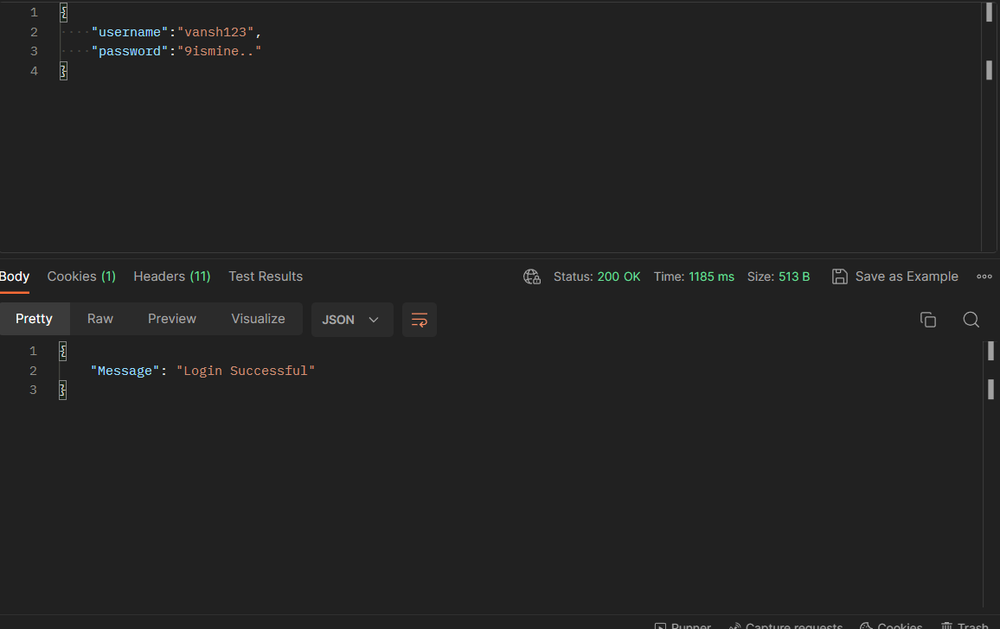
A cookie will be set with the name "JWT_TOKEN" and the value will be the JWT token for the user.

<hr>
<br>

## Signup (POST)
``` https://api.slamapp.co/auth/signup ```

Body:
- username: required
- email: required
- password: required
- first_name: required
- last_name: required

Response:
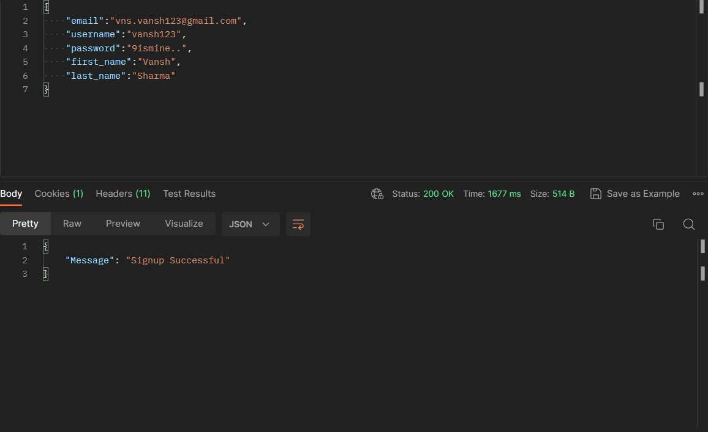
A cookie will be set with the name "JWT_TOKEN" and the value will be the JWT token for the user.

<hr>
<br>

## Logout (POST)
``` https://api.slamapp.co/auth/logout ```

Response:
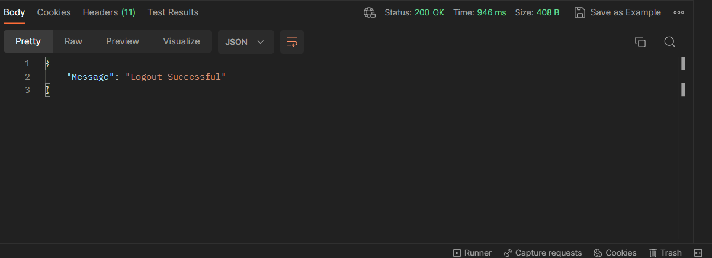
The cookie with the name "JWT_TOKEN" will be deleted.

<hr>
<br>

# Pipeline API

## Get Contact (GET)
``` https://api.slamapp.co/pipeline/contact ```

Response:
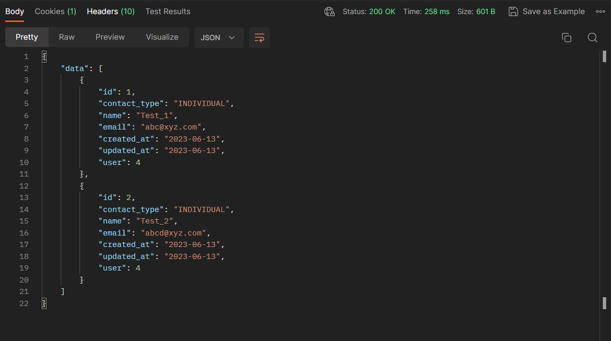

<hr>
<br>

## Post Contact (POST)
``` https://api.slamapp.co/pipeline/contact ```

Body:
- name: required
- email: required
- contact_type: required (must be one of the following: "individual", "company")

Response:
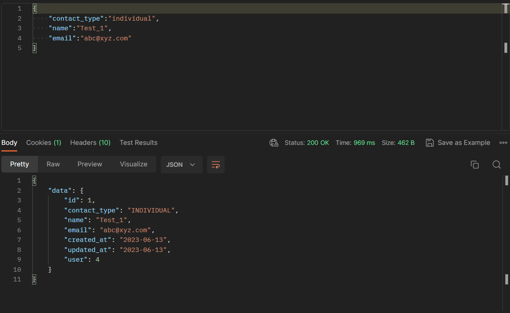

<hr>
<br>

## Put Contact (PUT)
``` https://api.slamapp.co/pipeline/contact ```

Body:
- contact: required
- name: optional
- email: optional
- contact_type: optional (must be one of the following: "individual", "company")
  
Response:
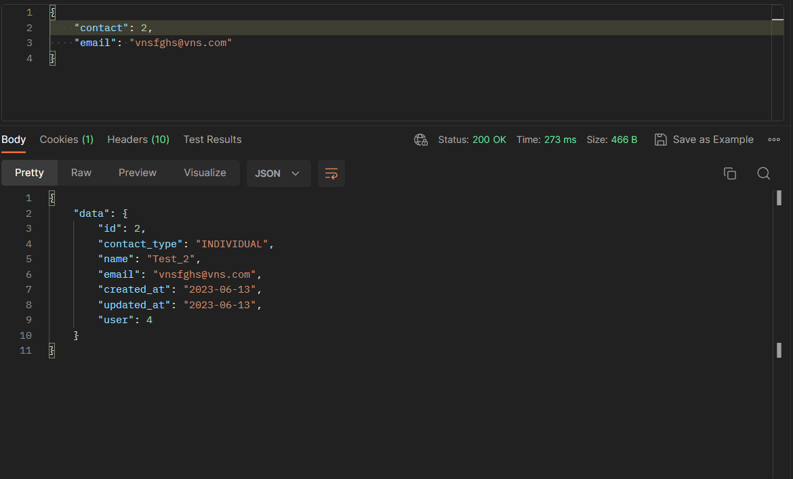

<hr>
<br>

## Delete Contact (DELETE)
``` https://api.slamapp.co/pipeline/contact ```

Body:
- contact: required

Response:
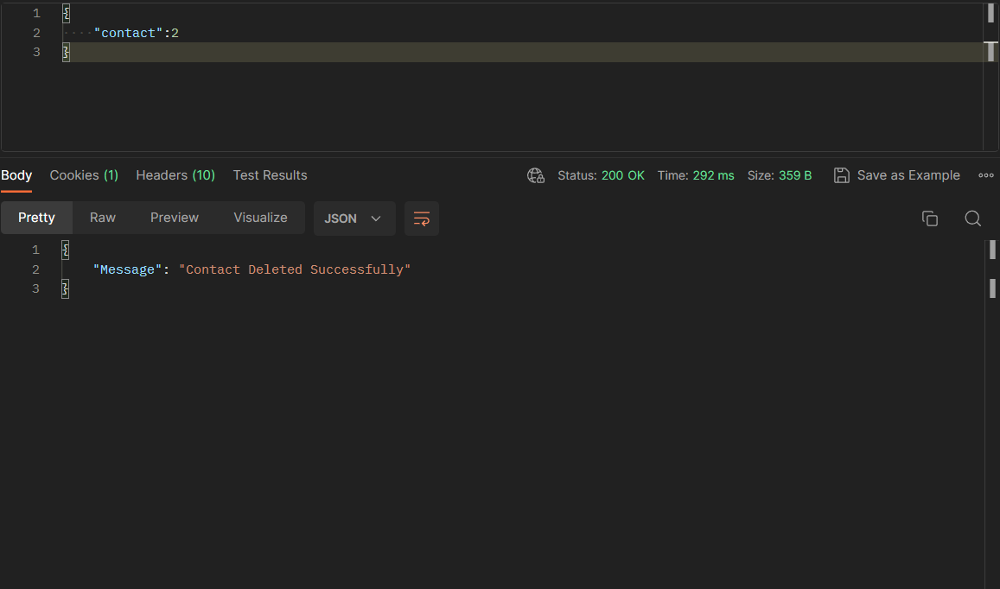

<hr>
<br>

## Get Address (GET)
``` https://api.slamapp.co/pipeline/address ```

Response:
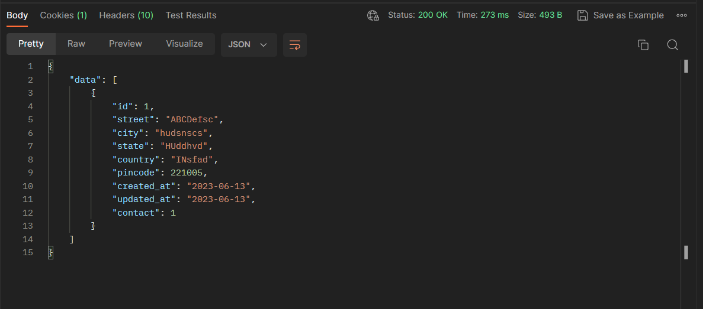

<hr>
<br>

## Post Address (POST)
``` https://api.slamapp.co/pipeline/address ```

Body:
- contact: required
- street: required
- city: required
- state: required
- country: required
- pincode: required

Response:
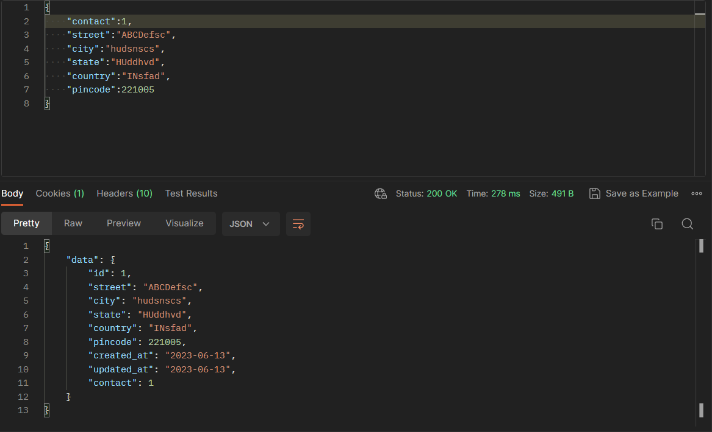

<hr>
<br>

## Put Address (PUT)
``` https://api.slamapp.co/pipeline/address ```

Body:
- address: required
- street: optional
- city: optional
- state: optional
- country: optional
  
Response:
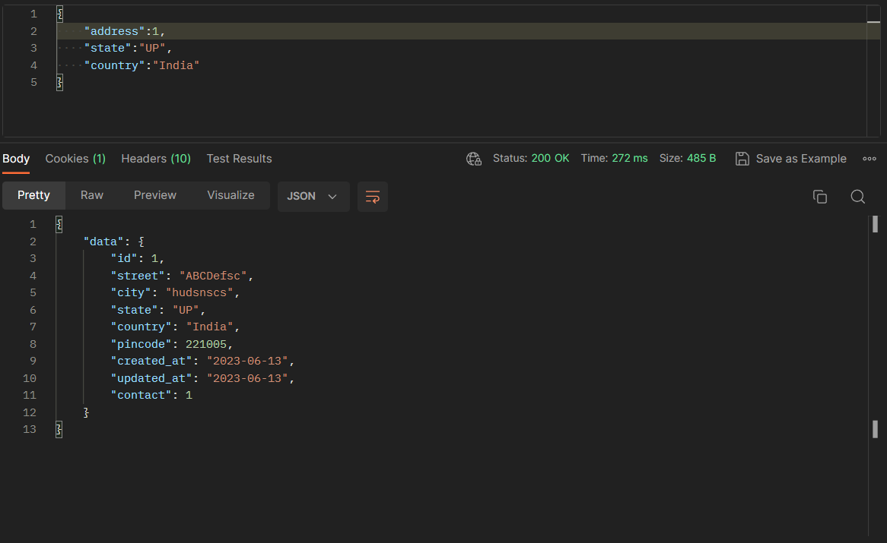

<hr>
<br>

## Delete Address (DELETE)
``` https://api.slamapp.co/pipeline/address ```

Body:
- address: required
  
Response:
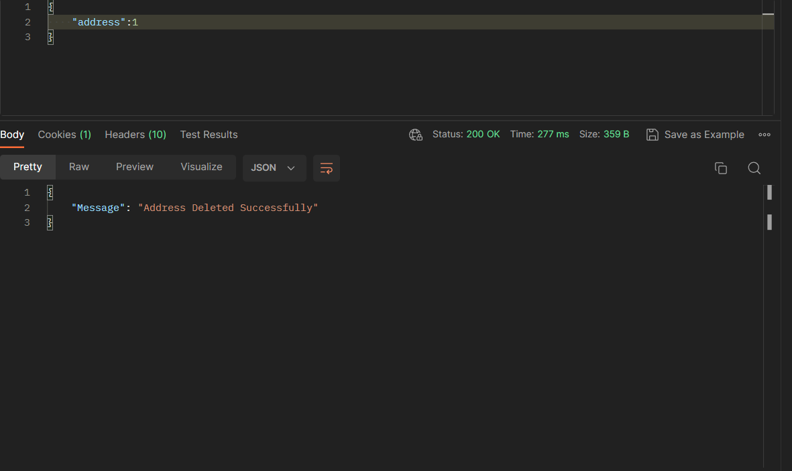

<hr>
<br>

## Get Lead (GET)
``` https://api.slamapp.co/pipeline/lead ```

Response:
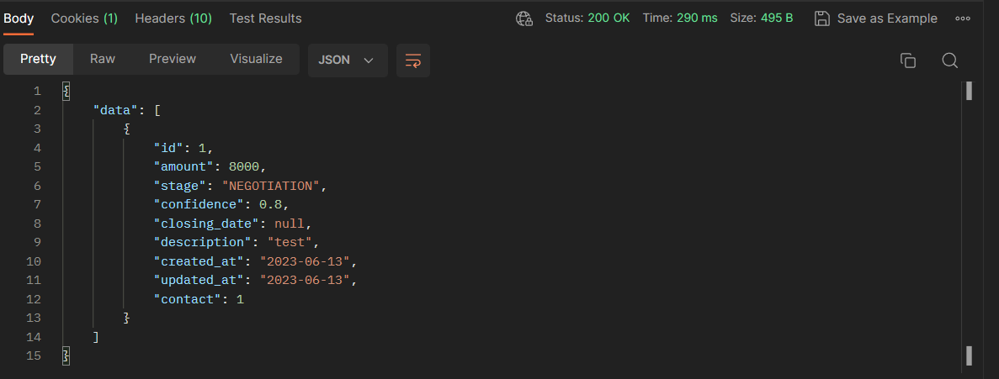

<hr>
<br>

## Post Lead (POST)
``` https://api.slamapp.co/pipeline/lead ```

Body:
- contact: required
- amount: required ("contacted", "negotiation", "closed_won")
- stage: required (must be one of the following: "opportunity", "contacted", "negotiation", "closed_won", "closed_lost")
- confidence: required (must be between 0 and 1 inclusive)
- closing_date: required ("closed_won") (must be in the format YYYY-MM-DD)
- description: optional
  
Response:
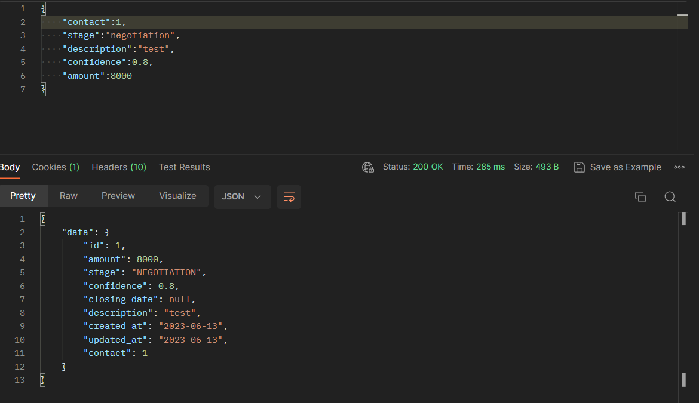

<hr>
<br>

## Put Lead (PUT)
``` https://api.slamapp.co/pipeline/lead ```

Body:
- lead: required
- amount: optional (required for "contacted", "negotiation", "closed_won")
- stage: optional (must be one of the following: "opportunity", "contacted", "negotiation", "closed_won", "closed_lost")
- confidence: optional (must be between 0 and 1 inclusive)
- closing_date: optional (required for "closed_won") (must be in the format YYYY-MM-DD)
- description: optional

Response:


<hr>
<br>

## Delete Lead (DELETE)
``` https://api.slamapp.co/pipeline/lead ```

Body:
- lead: required

Response:
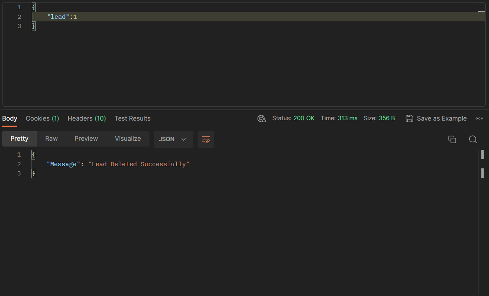
